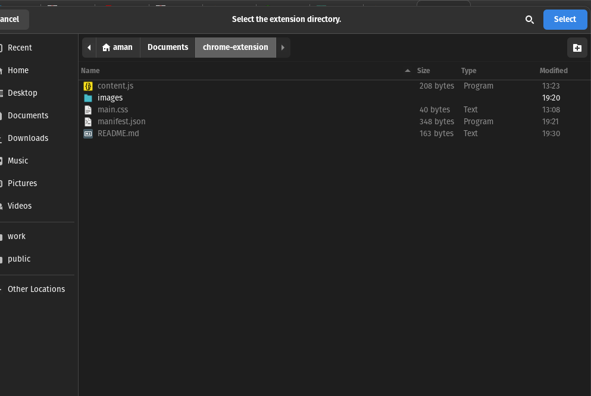

# Documentation

## Steps :-

## 1. Go to extensions tab in chrome browser
## 2. Enable Developer mode
## 3. Click on Load unpacked
## 4. Select extension folder
## 5. After installing extension visit bbc article site[BBC Article](https://www.bbc.com/news/world-europe-65606385)

## 6. You will be prompted to open summary page press yes

### Screen shots

